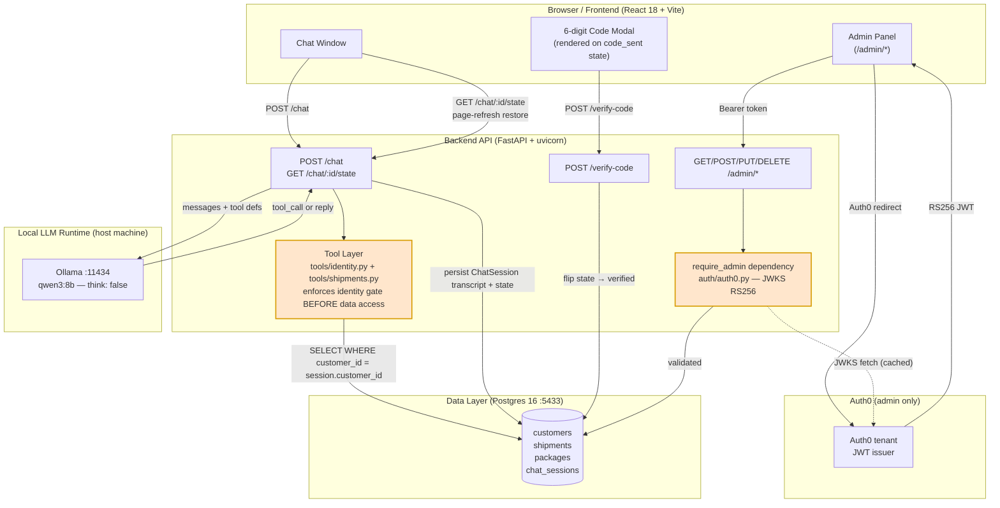

# 6.1 High-Level System Architecture

> Regenerated in Week 5 against the actual implementation.

**Key decisions reflected here:**

- **No separate session store.** All state lives in Postgres `chat_sessions`. `GET /chat/:id/state` restores full UI state on page refresh without an LLM call.
- **Identity gate is in the tool layer, not the prompt.** The model *requests* a tool; whether it executes depends on `session.state` and `session.customer_id` in the DB row.
- **Two identity systems never intersect.** `require_admin` validates Auth0 JWTs and never reads `ChatSession`. Chat routes never import from `auth/`. Proven by `scripts/test_separation.py`.
- **Ollama runs on the host**, not in Docker, to preserve Apple Metal GPU acceleration.
- **Shipment tool results are not replayed** from transcript — always re-queried so admin changes are immediately reflected in chat.
