# 6.2 Conversation / Identity-Gating State Machine

> Regenerated in Week 5 against the actual implementation (`models/chat_session.py`, `routes/chat.py`, `routes/verify.py`, `tools/identity.py`).

```mermaid
stateDiagram-v2
    [*] --> anonymous : new session created

    anonymous --> anonymous : general shipping questions
    anonymous --> collecting_identity : user asks about their shipments\n→ model calls request_identity_info()

    collecting_identity --> collecting_identity : partial info given / verification failed\n(neutral rejection, no field hint)
    collecting_identity --> code_sent : full info matches a Customer row\n→ model calls verify_identity()\n→ 6-digit code generated, logged to console

    code_sent --> awaiting_code : modal shown to user
    awaiting_code --> verified : correct code entered via modal\n(POST /verify-code) or chat\n→ session.customer_id set
    awaiting_code --> awaiting_code : wrong code, attempts < 3\n→ attempts_remaining decremented
    awaiting_code --> code_sent : max attempts exceeded OR code expired\n→ user asks to resend\n→ model calls send_verification_code()

    verified --> verified : shipment queries — always scoped to\nsession.customer_id, never model-supplied
    verified --> escalated_to_human : user requests a human agent\n(data access preserved)

    anonymous --> escalated_to_human : user requests a human agent\n(data access still blocked)
    collecting_identity --> escalated_to_human : user requests a human agent

    escalated_to_human --> escalated_to_human : scripted Melany persona;\nshipment data accessible only if\ncustomer_id was set before escalation

    anonymous --> anonymous : session > 24h old and unverified\n→ reset on next message
    collecting_identity --> anonymous : session > 24h old\n→ reset on next message
    code_sent --> anonymous : session > 24h old\n→ reset on next message
    awaiting_code --> anonymous : session > 24h old\n→ reset on next message
```

**Implementation notes:**

- State is stored in `ChatSession.state` (Postgres enum). There is no in-memory store.
- `verified` and `escalated_to_human` sessions are never reset by the timeout — the user completed the gate.
- `escalated_to_human` is a cosmetic state. The same `_can_access()` check in `tools/shipments.py` applies: data only flows if `customer_id IS NOT NULL`.
- `send_verification_code()` resets `code_attempts` to 0 and generates a fresh code, effectively unlocking a locked-out user.
- Code expiry window: **10 minutes**. Max attempts: **3**.
