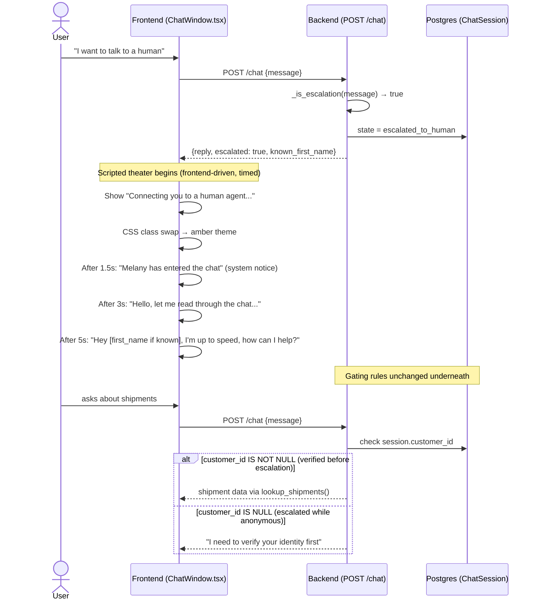

# 6.2b Human Escalation Sequence (Epic G)

> Regenerated in Week 5 against the actual implementation (`routes/chat.py`, `ChatWindow.tsx`).

**Implementation notes:**

- Escalation is detected by keyword matching (`ESCALATION_KEYWORDS` in `routes/chat.py`) on every message, in any session state.
- The backend sets `state = escalated_to_human` and returns `escalated: true`. All scripted theater (color shift, Melany persona, timed messages) runs entirely in `ChatWindow.tsx`.
- No real human, no ticketing system, no external handoff.
- The `_can_access()` gate in `tools/shipments.py` is shared between normal and escalated sessions — it checks `customer_id IS NOT NULL`, not the `escalated_to_human` state alone.
- If a verified user escalates, `session.customer_id` is already set, so Melany can answer shipment queries.
- If an anonymous user escalates, `customer_id` is null, so Melany must still run the identity gate before sharing data.
