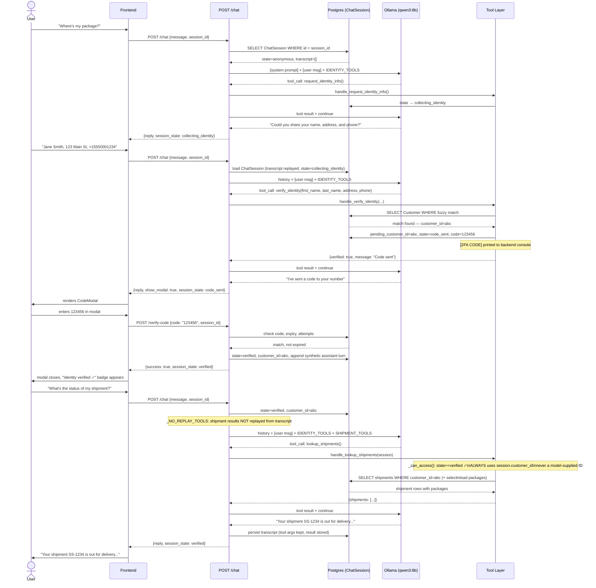

# 6.3 Tool-Calling Sequence (HTTP Transport)

> Regenerated in Week 5 against the actual implementation (`routes/chat.py`, `tools/`).

**Implementation notes:**

- History is reconstructed from `ChatSession.transcript` on every request — there is no in-memory context.
- Identity tool call results (`request_identity_info`, `send_verification_code`, `check_verification_code`) are replayed as `role: assistant + role: tool` pairs so the model retains state-transition context.
- Shipment tool results (`lookup_shipments`, `get_shipment_details`) are **not** replayed (`_NO_REPLAY_TOOLS`). The model is instructed to always re-call them, ensuring admin edits are immediately visible.
- The tool loop runs up to 5 iterations per request. The system prompt is rebuilt each iteration so state transitions are reflected in the same exchange.
- `verify_identity` arguments are redacted to `{"_redacted": True}` before transcript persistence.
