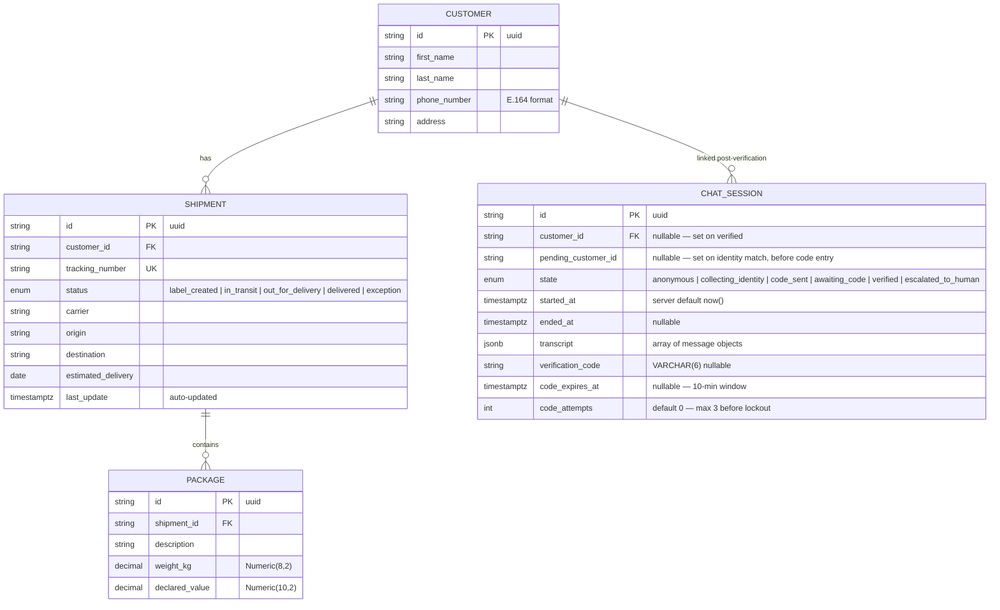

# 6.4 Data Model (ERD)

> Regenerated in Week 5 against the actual SQLAlchemy models (`backend/models/`).



**Transcript JSONB schema** — each element:
```json
{
  "role": "user | assistant",
  "content": "string",
  "timestamp": "ISO-8601",
  "tool_calls": [
    {
      "name": "tool_name",
      "arguments": {"key": "value"},
      "result": {"key": "value"}
    }
  ]
}
```

`verify_identity` arguments are always stored as `{"_redacted": true}` — name, address, and phone number are never persisted to the transcript.

**Admin identity** lives entirely in Auth0 — there is no `admin_users` table. The JWT payload (sub, email) is returned from `GET /admin/me` but never written to the database.
