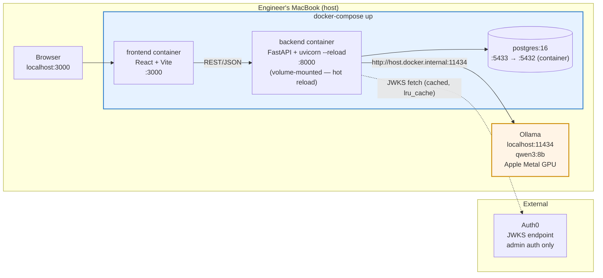

# 6.5 Deployment / Local Dev Topology

> Regenerated in Week 5 against the actual `docker-compose.yml`.

**Port map:**

| Service  | Host port | Container port | Notes |
|----------|-----------|----------------|-------|
| Frontend | 3000      | 3000           | Vite dev server |
| Backend  | 8000      | 8000           | uvicorn with `--reload` |
| Postgres | **5433**  | 5432           | Offset to avoid local Postgres conflict |
| Ollama   | 11434     | —              | Host machine only |

**Volume mounts:**

| Container | Mount | Purpose |
|-----------|-------|---------|
| backend   | `./backend:/app` | Hot reload via uvicorn `--reload` |
| frontend  | none | Changes require `docker-compose up --build` |
| postgres  | `pgdata` volume | Data persists across restarts |

**Environment variables** (from `secureship/.env`, see `.env.example`):

| Variable | Used by | Purpose |
|----------|---------|---------|
| `AUTH0_DOMAIN` | backend + frontend | Auth0 tenant domain |
| `AUTH0_CLIENT_ID` | frontend | SPA client ID |
| `AUTH0_AUDIENCE` | backend + frontend | API identifier for JWT audience claim |
| `DATABASE_URL` | backend | Postgres connection string |
| `OLLAMA_HOST` | backend | Ollama address from inside Docker |
